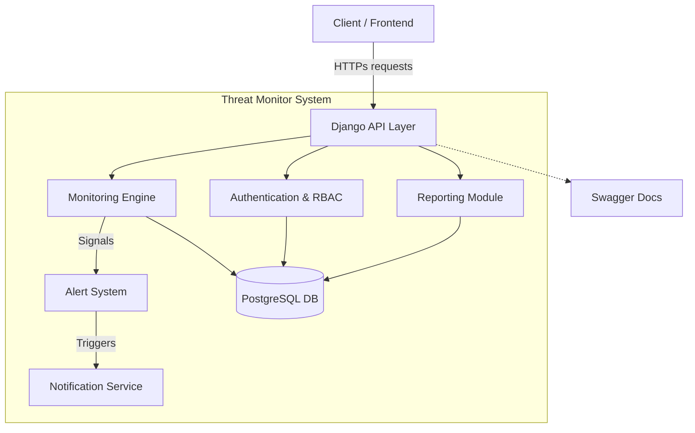

# Django Threat Monitoring & Alert Management Platform

A comprehensive security threat monitoring API built with Django and Django REST Framework.

## 🚀 Features

- **Authentication**: JWT-based auth with Role-Based Access Control (Admin, Analyst).
- **Core Models**: Security Events, Alerts, Audit Logs.
- **Automation**: Signals to auto-generate alerts from high-severity events.
- **Security**: Rate limiting, security headers, role-based permissions.
- **Documentation**: Swagger/OpenAPI integration.
- **Deployment**: Dockerized setup ready for production.

## 🛠️ Tech Stack

- Python 3.11+
- Django 4.2
- Django REST Framework
- PostgreSQL (Production) / SQLite (Dev)
- Redis (Caching - Optional)

## 🏗️ Project Architecture

The Threat Monitor API follows a modular Django structure, separating concerns into distinct apps and services.

### System Diagram



### Core Components

1.  **Authentication (`apps.authentication`)**: Handles User registration, Login, JWT issuance, and Role-Based Access Control (RBAC).
2.  **Monitoring (`apps.monitoring`)**: Captures Security Events (e.g., failed logins, suspicious IPs) and manages the logic for threat detection.
3.  **Core (`apps.core`)**: Contains shared utilities, base models, and global configurations.
4.  **Signals & Automation**: Django signals are used to decouple event creation from alert generation, allowing for asynchronous processing and cleaner code.

## � Project Structure

```text
threat-monitor-api/
├── apps/
│   ├── authentication/   # User management & RBAC
│   ├── monitoring/       # Threat detection logic
│   └── core/             # Shared utilities & base models
├── config/
│   ├── settings/         # Django settings (base, local, prod)
│   ├── urls.py           # Main URL routing
│   └── wsgi.py           # WSGI entry point
├── tests/                # Pytest test suite
├── .dockerignore
├── .gitignore
├── Dockerfile            # Docker build instructions
├── docker-compose.yml    # Docker services config
├── manage.py             # Django management script
└── README.md             # Project documentation
```

## �📦 Setup Instructions

## 📦 Setup Instructions

You can run the project using **Docker (Recommended)** or setup a **Local Environment (Manual)**.

### 1️⃣ Environment Setup (Required for both)

1.  **Clone the repository:**
    ```bash
    git clone https://github.com/premdwivedi/monitoring-api-django.git
    cd threat-monitor-api
    ```

2.  **Create `.env` file:**
    Copy the example file to `.env`:
    ```bash
    cp .env.example .env
    # Windows
    copy .env.example .env
    ```
    *Modify `.env` values if needed.*

---

### 🐳 Option A: Docker Startup (Quickest)

Run the entire application (API + Database) with one command.

1.  **Build and Start Containers:**
    ```bash
    docker-compose up --build
    ```

2.  **Access the Application:**
    - The API is available at `http://localhost:8000/api/v1/`
    - Swagger Documentation: `http://localhost:8000/api/docs/`

3.  **Run Migrations (if needed just once):**
    Usually, the entrypoint handles this, but you can run manually:
    ```bash
    docker-compose exec web python manage.py migrate
    ```

4.  **Create Superuser:**
    ```bash
    docker-compose exec web python manage.py createsuperuser
    ```

---

### 🛠️ Option B: Local Development (Manual)

If you want to run Python directly on your machine.

1.  **Prerequisites:**
    - Python 3.11+
    - PostgreSQL (Optional, defaults to SQLite)

2.  **Create Virtual Environment:**
    ```bash
    python -m venv venv
    
    # Linux/Mac
    source venv/bin/activate
    
    # Windows
    venv\Scripts\activate
    ```

3.  **Install Dependencies:**
    ```bash
    pip install -r requirements.txt
    ```

4.  **Apply Migrations:**
    ```bash
    python manage.py migrate
    ```

5.  **Create Superuser:**
    ```bash
    python manage.py createsuperuser
    ```

6.  **Run Server:**
    ```bash
    python manage.py runserver
    ```

7.  **Access:**
    Open `http://127.0.0.1:8000/api/docs/` in your browser.

---

## 🧪 Running Tests

```bash
# Local
pytest

# Docker
docker-compose exec web pytest
```

## 📚 API Documentation

| Method | Endpoint | Description | Permission |
|--------|----------|-------------|------------|
| POST | `/api/v1/auth/register/` | Register new user | Any |
| POST | `/api/v1/auth/login/` | Login & get JWT | Any |
| GET | `/api/v1/events/` | List security events | Authenticated |
| POST | `/api/v1/events/` | Create security event | Authenticated |
| GET | `/api/v1/alerts/` | List alerts | Authenticated |
| POST | `/api/v1/alerts/{id}/resolve/` | Resolve alert | Analyst/Admin |
| GET | `/api/v1/auditlogs/` | View audit logs | Admin only |

For full documentation, visit the Swagger UI at `/api/docs/`.
